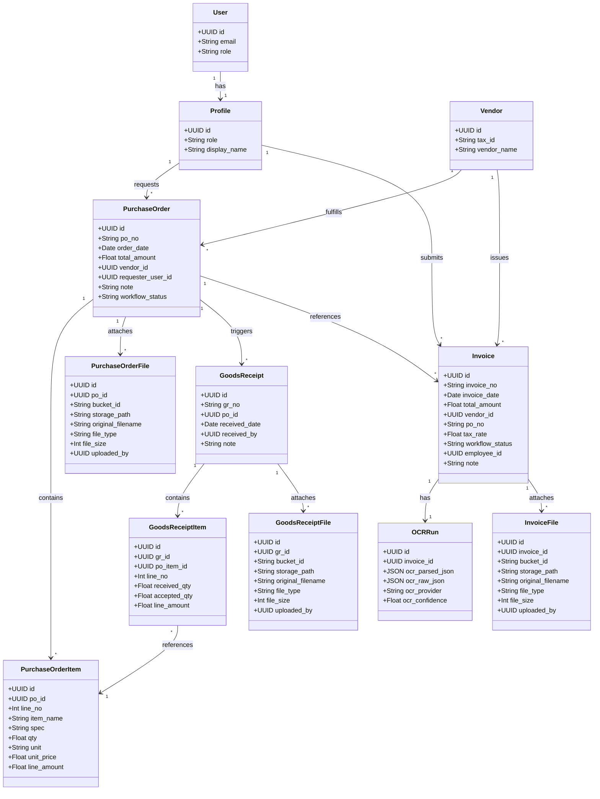
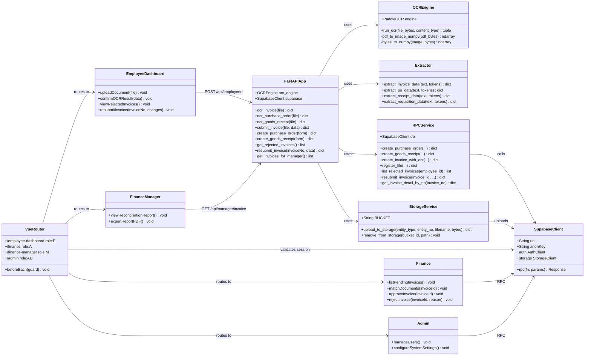
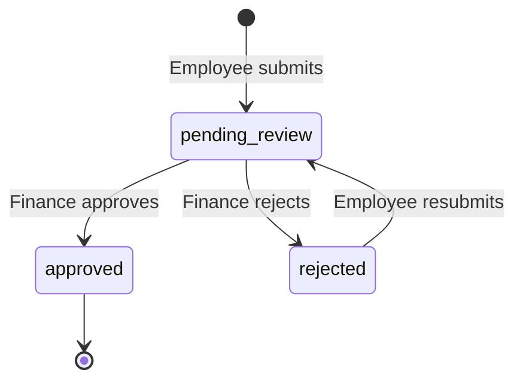

# Class Diagram

## Domain Model (Database Entities)

```mermaid
classDiagram
    direction TB

    class User {
        +UUID id
        +String email
        +String role
    }

    class Profile {
        +UUID id
        +String role
        +String display_name
    }

    class Vendor {
        +UUID id
        +String tax_id
        +String vendor_name
    }

    class PurchaseOrder {
        +UUID id
        +String po_no
        +Date order_date
        +Float total_amount
        +UUID vendor_id
        +UUID requester_user_id
        +String note
        +String workflow_status
    }

    class PurchaseOrderItem {
        +UUID id
        +UUID po_id
        +Int line_no
        +String item_name
        +String spec
        +Float qty
        +String unit
        +Float unit_price
        +Float line_amount
    }

    class PurchaseOrderFile {
        +UUID id
        +UUID po_id
        +String bucket_id
        +String storage_path
        +String original_filename
        +String file_type
        +Int file_size
        +UUID uploaded_by
    }

    class GoodsReceipt {
        +UUID id
        +String gr_no
        +UUID po_id
        +Date received_date
        +UUID received_by
        +String note
    }

    class GoodsReceiptItem {
        +UUID id
        +UUID gr_id
        +UUID po_item_id
        +Int line_no
        +Float received_qty
        +Float accepted_qty
        +Float line_amount
    }

    class GoodsReceiptFile {
        +UUID id
        +UUID gr_id
        +String bucket_id
        +String storage_path
        +String original_filename
        +String file_type
        +Int file_size
        +UUID uploaded_by
    }

    class Invoice {
        +UUID id
        +String invoice_no
        +Date invoice_date
        +Float total_amount
        +UUID vendor_id
        +String po_no
        +Float tax_rate
        +String workflow_status
        +UUID employee_id
        +String note
    }

    class OCRRun {
        +UUID id
        +UUID invoice_id
        +JSON ocr_parsed_json
        +JSON ocr_raw_json
        +String ocr_provider
        +Float ocr_confidence
    }

    class InvoiceFile {
        +UUID id
        +UUID invoice_id
        +String bucket_id
        +String storage_path
        +String original_filename
        +String file_type
        +Int file_size
        +UUID uploaded_by
    }

    User "1" --> "1" Profile : has
    Profile "1" --> "*" PurchaseOrder : requests
    Vendor "1" --> "*" PurchaseOrder : fulfills
    PurchaseOrder "1" --> "*" PurchaseOrderItem : contains
    PurchaseOrder "1" --> "*" PurchaseOrderFile : attaches
    PurchaseOrder "1" --> "*" GoodsReceipt : triggers
    GoodsReceipt "1" --> "*" GoodsReceiptItem : contains
    GoodsReceiptItem "*" --> "1" PurchaseOrderItem : references
    GoodsReceipt "1" --> "*" GoodsReceiptFile : attaches
    PurchaseOrder "1" --> "*" Invoice : references
    Vendor "1" --> "*" Invoice : issues
    Profile "1" --> "*" Invoice : submits
    Invoice "1" --> "1" OCRRun : has
    Invoice "1" --> "*" InvoiceFile : attaches
```

## Application Architecture

```mermaid
classDiagram
    direction LR

    class FastAPIApp {
        +OCREngine ocr_engine
        +SupabaseClient supabase
        +ocr_invoice(file) dict
        +ocr_purchase_order(file) dict
        +ocr_goods_receipt(file) dict
        +submit_invoice(file, data) dict
        +create_purchase_order(form) dict
        +create_goods_receipt(form) dict
        +get_rejected_invoices() list
        +resubmit_invoice(invoiceNo, data) dict
        +get_invoices_for_manager() list
    }

    class OCREngine {
        +PaddleOCR engine
        +run_ocr(file_bytes, content_type) tuple
        -pdf_to_image_numpy(pdf_bytes) ndarray
        -bytes_to_numpy(image_bytes) ndarray
    }

    class Extractor {
        +extract_invoice_data(text, tokens) dict
        +extract_po_data(text, tokens) dict
        +extract_receipt_data(text, tokens) dict
        +extract_requisition_data(text, tokens) dict
    }

    class StorageService {
        +String BUCKET
        +upload_to_storage(entity_type, entity_no, filename, bytes) dict
        +remove_from_storage(bucket_id, path) void
    }

    class RPCService {
        +SupabaseClient db
        +create_purchase_order(...) dict
        +create_goods_receipt(...) dict
        +create_invoice_with_ocr(...) dict
        +register_file(...) dict
        +list_rejected_invoices(employee_id) list
        +resubmit_invoice(invoice_id, ...) dict
        +get_invoice_detail_by_no(invoice_no) dict
    }

    class VueRouter {
        +/employee-dashboard role:E
        +/finance role:A
        +/finance-manager role:M
        +/admin role:AD
        +beforeEach(guard) void
    }

    class EmployeeDashboard {
        +uploadDocument(file) void
        +confirmOCRResult(data) void
        +viewRejectedInvoices() void
        +resubmitInvoice(invoiceNo, changes) void
    }

    class Finance {
        +listPendingInvoices() void
        +matchDocuments(invoiceId) void
        +approveInvoice(invoiceId) void
        +rejectInvoice(invoiceId, reason) void
    }

    class FinanceManager {
        +viewReconciliationReport() void
        +exportReportPDF() void
    }

    class Admin {
        +manageUsers() void
        +configureSystemSettings() void
    }

    class SupabaseClient {
        +String url
        +String anonKey
        +auth AuthClient
        +storage StorageClient
        +rpc(fn, params) Response
    }

    FastAPIApp --> OCREngine : uses
    FastAPIApp --> Extractor : uses
    FastAPIApp --> StorageService : uses
    FastAPIApp --> RPCService : uses
    RPCService --> SupabaseClient : calls
    StorageService --> SupabaseClient : uploads

    VueRouter --> EmployeeDashboard : routes to
    VueRouter --> Finance : routes to
    VueRouter --> FinanceManager : routes to
    VueRouter --> Admin : routes to
    VueRouter --> SupabaseClient : validates session

    EmployeeDashboard --> FastAPIApp : POST /api/employee/*
    Finance --> SupabaseClient : RPC
    FinanceManager --> FastAPIApp : GET /api/manager/invoice
    Admin --> SupabaseClient : RPC
```

## Workflow Status Transitions (Invoice)

```mermaid
stateDiagram-v2
    [*] --> pending_review : Employee submits
    pending_review --> approved : Finance approves
    pending_review --> rejected : Finance rejects
    rejected --> pending_review : Employee resubmits
    approved --> [*]
```
